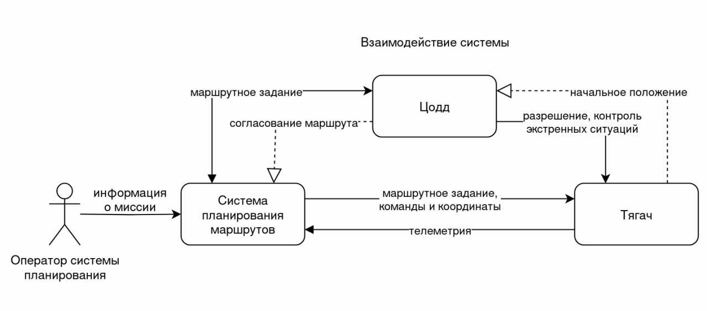

# Отчет о выполнеии задачи "Беспилотный тягач"

- [Отчет о выполнении задачи "Беспилотный тягач"](#отчет-о-выполнеии-задачи-беспилотный-тягач)
  - [Постановка задачи](#постановка-задачи)
  - [Ценности, ущербы и неприемлимые события](#ценности-ущербы-и-неприемлимые-события)
  - [Цели и предложения безопасности](#цели-и-предложеняи-безопасности-цпб)
  - [Архитектура системы](#архитектура-системы)
  - [Компоненты](#компоненты)
  - [Алгоритм работы решения](#алгоритм-работы-решения)
  - [Негативные сценарии](#негативные-сценарии)
  - [Переработанная архитектура](#переработанная-архитектура)
  - [Указание «доверенных компонентов» на архитектурной диаграмме](#указание-доверенных-компонентов-на-архитектурной-диаграмме)
  - [Политика безопасности](#политика-безопасности)

## Постановка задачи

Компания создает беспилотный тягач для транспортировки грузов на большие расстояния, включая сложные участки дороги: такие как горные перевалы, лесные массивы и пустынные территории. Основной задаче является обеспечение автономного выполнения маршрута без постоянного вмешательства оператора.При этом важно учитывать, что на этих же дорогах могут находиться другие транспортные средства, включая спецтранспорт. Чтобы избежать потенциальных аварий, тягач должен быть способен предупреждать потенциальные аварии, корректно взаимодействовать с другими транспортными средствами и инфраструктурой

## Ценности, ущербы и неприемлимые события

| Ценность | Негативное событие | Оценка ущерба | Коментарий |
|:--|:--|:--|:--|
|Тягач| В результате атаки или сбоя системы тягач вышел из строя или был угнан | Средний | *Тягач застрахован, но простой в работе и необходимости восстановления могут привести к задержкам в доставке грузов.* |
|Люди| Тягач стал причиной ДТП, повлекшего вред здоровью или жизни людей | Высокий |*Наибольший приоритет - безопасеость людей. Необходимо минимизировать риски столкновений с другими транспортными средствами или пешеходами.* |
|Груз| Груз поврежден или утерян в рузельтате аварии или сбоя системы | Средний/Высокий | *Ущерб зависит от ценности груза. Потеря или повреждение критического груза (наример медицинского оборудования) может иметь серьезные последствия.* |
|Данные мониторинга| Данные о маршрутах, грузах и состоянии тягача оказались доступны злоумышленникам | Высокий | *Нарушение конфиденциальности, возможны утечки комерческой тайны или данных, защищенных законом.* |
|Инфраструктура| Тягач врезался в объект критической инфраструктуры | Высокий | *Повреждение инфрастуктуры может привести к масштабным последствиям, включая остановку работы объектов и значительные финансовые потери.* |
|Имущество третьих лиц| Тягач врезался в транспортное средство или объект частной собственности | Высокий | *Ущерб имуществу третих лиц может привести к судебным искам и репутационным потерям.* |
|Репутация компании| Авария или утечка данных привлекли внимание СМИ или регуляторов | Высокий | *Потеря доверия клиентов, штрафы со стороны регуляторов, возможны ограничения на использование автопилотируемых систем.* |
|Экология| Тягач стал причиной развала топлива или повреждения экологически чуствительных зон | Высокий | *Экологические последствия могут привести к штрафам и репутационному ущербу.* |


## Цели и предложеняи безопасности (ЦПБ)

### Цели безопасности: 

1. Выполняются только авторизированные ЦОДД задания
2. Все маневры и перемещения должны выполняться строго в соответствие с заданным маршрутом, ограничениями скорости и зонами движения.
3. В случае критического оттказа систем, тягач должен перейти в безопасный режим ( остановиться или снизить скорость до минимальной чтобы избежать аварий)
4. Погрузка/отгрузка груза осуществяются только в заднных координатах.

### Предложения безопасности:

1. Аутентичная система ЦОДД благонадёжна
2. Система управления маршрутом благонадёжна
3. Аутеннтичные сотрудники благонадёжны и обладают необходимой квалификацией.
4. Только авторизированные сотрудники управляют системами
5. Используемые сенсоры и исполнительные устройства работают в рамках заявленных характеристик.
6. Монитор безопасности и брокер сообщений доверенные модули.
7. Процедуры обновления и технического обслуживания проходят только в доверенной среде
8. Груз соответствует установленным требованиям безопасности.

## Архитектура системы

- Только инженер службы эксплуатации имеет физический доступ к транспортному средсвту.

### Взаимодействие системы



### Сценарий работы


## Компоненты

### Базовая архитектура


### Базовая диаграмма последовательности


|Компонент | Назначение |
|:--|:--|
|`1. Связь` | *Отвечает за взаимодействие с системой планирования маршрутом и ЦОДД.* |
|`2. Сбор и обработка данных` | *Собирает и анализирует данные об объектах вокруг транспортного средства для обеспечения безопасности.* |
|`3. Принятие решений` | *Использует данные, полученные в результате анализа, для принятия решений, которые влияют на работу системы и безопасность движения.* |
|`4. Центральная система управления` | *Осуществляет общее управление транспортом, контролирует выполнение задания.* |
|`5. Система мониторинга груза` | *Отслеживает состояние груза в пути и наличие в кузове.* |
|`6. Навигация` | *Предоставляет информацию о местоположении и направлении движения, используя данные GPS или другие навигационные системы.* |
|`8. Управление движением` | *Контролирует и координируют движение транспортного средства.* |
|`9. Исполнительные устройства` | *Отвечает за физическое выполнение команд, поступающих от системы управления движением, включая управление двигателем, рулевым управлением, тормозами и фарами.* |
|`10. Самодиагностика` | *Проверяет и анализирует состояние системы, выявляя возможные неисправности или проблемы.* | 

## Алгоритм работы решения

### Нарушение ЦБ(Целей безопасности) в базовом решении

***Напоминание ЦБ:***
1. *Выполняются только авторизированные ЦОДД задания.*
2. *Все маневры и перемещения должны выполняться строго в соответствие с заданным маршрутом, ограничениями скорости и зонами движения.*
3. *В случае критического оттказа систем, тягач должен перейти в безопасный режим ( остановиться или снизить скорость до минимальной чтобы избежать аварий)*
4. *Погрузка/отгрузка груза осуществяются только в заднных координатах.*


|Атакованный компонент| ЦБ1 | ЦБ2 | ЦБ3 | ЦБ4 | Кол-во нарушений|
|:--|:--|:--|:--|:--|:--|
|`1. Связь` | 🔴 | 🔴 | 🟢 | 🔴 | 3/4 |
|`2. Сбор и обработка данных` | 🟢 | 🔴 | 🟢 | 🟢 | 1/4 |
|`3. Принятие решений` | 🟢 | 🔴 | 🔴 | 🟢 | 2/4 |
|`4. Центральная система управления` | 🔴 | 🔴 | 🔴 | 🔴 | 4/4|
|`5. Система мониторинга груза` | 🔴 | 🔴 | 🔴 | 🔴  | 4/4
|`6. Навигация` | 🔴 | 🔴  | 🟢 | 🔴  | 3/4
|`8. Управление движением` | 🔴 | 🔴 | 🔴 | 🟢 | 3/4
|`9. Исполнительные устройства` | 🟢 | 🔴 | 🔴 | 🟢 |  2/4
|`10. Самодиагностика` | 🟢 | 🟢 | 🔴 | 🟢 | 1/4

🟢 - ЦБ - не нарушена 🔴 - ЦБ нарушена

## Негативные сценарии

### Цели безопасности:

1. Выполняются только авторизированные ЦОДД задания
2. Все маневры и перемещения должны выполняться строго в соответствие с заданным маршрутом, ограничениями скорости и зонами движения.
3. В случае критического оттказа систем, тягач должен перейти в безопасный режим ( остановиться или снизить скорость до минимальной чтобы избежать аварий)
4. Погрузка/отгрузка груза осуществяются только в заднных координатах.

### Таблица негативных сценариев

| Негативные сценарии |   |
|:--:|:--:|
|**НС-1**| *Модуль связи передаёт некорректные координаты загрузки/отгрузки в центральную систему управления, что приводит к нарушению ЦБ 1,2,4* |
|**НС-2**| *Модуль навигации отдаёт неправильные данные о местоположении тягача, что приводит к отклонению от заданного маршрута и нарушению ЦБ 1,2,4* |
|**НС-3**| *Модуль самодиагностики не обнаруживает критический отказ двигателя или тормозной системы, что приводит к невозможности перехода в безопасный режим и нарушению ЦБ 3* |
|**НС-4**| *Модуль управления движением отправляет некорректные сигналы на исполнительные устройства, что приводит к несанкционированному ускорению или торможению, нарушая ЦБ 2.* |
|**НС-5**| *Модуль связи скомпрометирован. При получении запрета на выезд от ЦОДД, система распознаёт его как разрешение и начинает движение по запрещённому маршруту, нарушая ЦБ 1 и ЦБ 2* |
|**НС-6**| *Модуль принятия решений скомпрометирована. Атака приводит к тому, что модуль принятия решений начинает игнорировать ограничения скорости или запрещённые зоны движения, корректируя управляющие команды в нарушение требований. Нарушается ЦБ 2* |
|**НС-7**| *Модуль исполнительных устройств скомпроментирован. Подмена верных команд он выполняет не верные управляющие команды. ЦБ 2,3,4* |

## Негативные сценарии 

### НС-1


### НС-2


### НС-3


### НС-4


### НС-5


### НС-6


### НС-7


## Переработанная архитектура


### Описание декомпозиции

<table>
    <thead>
        <tr>
            <th align="center">Исходный компонент</th>
            <th align="center">Декомпозиция</th>
        </tr>
    </thead>
    <tbody>
        <tr>
            <td rowspan=4 align="center">Центральная система упраления</td>
            <td rowspan=1 align="center">Оркестратор задач</td>
        </tr>
        <tr>
            <td rowspan=1 align="center">Аварийный блок</td>
        </tr>
        <tr>
            <td rowspan=1 align="center">Аварийное снижение скорости</td>
        </tr>
        <tr>
            <td rowspan=1 align="center">Планировщик маршрута</td>
        </tr>
        <tr>
            <td rowspan=3 align="center">Навигация</td>
            <td rowspan=1 align="center">Комплексирование</td>
        </tr>
        <tr>
            <td rowspan=1 align="center">Навигация ИНС</td>
        </tr>
        <tr>
            <td rowspan=1 align="center">Навигация GNSS</td>
        </tr>
        <tr>
            <td rowspan=4 align="center">Сбор и обработка данных</td>
            <td rowspan=1 align="center">Обработка данных</td>
        </tr>
        <tr>
            <td rowspan=1 align="center">Камеры</td>
        </tr>
        <tr>
            <td rowspan=1 align="center">Лидар</td>
        </tr>
        <tr>
            <td rowspan=1 align="center">ИК-датчики</td>
        </tr>
        <tr>
            <td rowspan=5 align="center">Исполнительные устройства</td>
            <td rowspan=1 align="center">Руление</td>
        </tr>
        <tr>
            <td rowspan=1 align="center">Система релуения</td>
        </tr>
        <tr>
            <td rowspan=1 align="center">Управление движением</td>
        </tr>
        <tr>
            <td rowspan=1 align="center">Разгон и торможение</td>
        </tr>
        <tr>
            <td rowspan=1 align="center">Сигнальные системы</td>
        </tr>
        <tr>
            <td rowspan=1 align="center">Связь</td>
            <td rowspan=1 align="center">Блок шифрования каналов</td>
        </tr>
        <tr>
            <td rowspan=1 align="center">Самодиагностика</td>
            <td rowspan=1 align="center">Система мониторинга груза</td>
        </tr>
    </tbody>
</table>

## Таблица новых компонентов

|Компонент|Описание|Комментарий|
|:---|:--|:--|
|1. Оркестратор задач|Распределение задач между блоками| |
|2. Аварийный блок|Получает данные об аварийной обстановке|В случае получения данных об аварийной обстановке записывет сохраняет координаты, время, место и причины, а так же отправляет сигнал на блок аварийного снижения скорости.|
|3. Навигация ИНС|Физический модуль ИНС дающий координаты транспортного средства.| |
|4. Навигация GNSS |Физический модуль GNSS дающий координаты транспортного средства. | |
|5. Комплексирование |Комплексирование навигационных данных. | |
|6. Планировщик маршрута |На основе полученных координат и маршрутного листа строит маршрут| |
|8. Обработка данных |Обрабатывает данные полученны от камер, лидара и ИК-датчиков | |
|9. Камеры |Физические модель камеры установленные на транспортном средстве| |
|10. Лидар |Физический модуль лидара установленный на транспортном средстве | |
|11. ИК-датчики |Физический модуль ИК-датчиков установленные на транспортом средстве | |
|12. Управление движением |Физический модуль получаемый данные от модуля принятия решений и формируемый команды для устройств приводов | |
|13. Руление |Физический модуль получаемый команды от модуля управления движением, анализируемый их и передающий сигнал на модуль системы руления| |
|14. Система руления|Система приводов приводящая в движение передние колема для совершения поворотов| |
|15. Управление двигателем |Физический модуль получаемый команды от модуля управления движением анализируемый их и передающий определенные команды на блок разгон и торможения | |
|16. Разгон и торможение |Физический модуль получаемый сигнал от модуля управления двигателем и совершающий ускорение или торможение транспортного средства | |
|17. Сигнальны системы |Физический модуль который управляет световыми приборами установленными на транспортном средстве | |
|18. Блок шифрования каналов |Расшифровка/шифрование принимаемых/отправляемых пакетов данных. |Работает при помощи SSL протокола. В рамках курсовой работы протокол не реализуется. Предполагается что в ЦОДД и Системе планирование маршрута тоже реализован данный функционал. Если это 5G сети то там используется ECIES+5G-AKA. |
|19. Система мониторнга груза |Отслеживает состояние груза (погружен/отгружен) | |
| | | |

## Диаграмма последовательности


## Указание «доверенных компонентов» на архитектурной диаграмме


### Таблица доверенных компонентов

|Компонент|Уровень доверия|Обоснование|Коментарий|
|:---|:--|:--|:--|
|1. Связь|$\textcolor{red}{\textsf{Недоверенный}}$|||
|2. Блок шифрования каналов|$\textcolor{yellow}{\textsf{Доверенный}}$|Соблюдение ЦБ 1||
|3. Оркестратор задач|$\textcolor{green}{\textsf{Доверенный}}$|||
|4. Навигация ИНС|$\textcolor{red}{\textsf{Доверенный}}$|||
|5. Навигация GNSS|$\textcolor{red}{\textsf{Доверенный}}$|||
|6. Комплексирование|$\textcolor{yellow}{\textsf{Доверенный}}$|Соблюдение ЦБ 2,4||
|7. Планировщик маршрута|$\textcolor{yellow}{\textsf{Доверенный}}$|Соблюдение ЦБ 2,4||
|8. Аварийный блок|$\textcolor{green}{\textsf{Доверенный}}$|Соблюдение ЦБ 3||
|9. Аварийное снижение скорости|$\textcolor{green}{\textsf{Доверенный}}$|Соблюдение ЦБ 3||
|10. Самодиагностика|$\textcolor{red}{\textsf{Недоверенный}}$|||
|11. Система мониторинга груза|$\textcolor{red}{\textsf{Доверенный}}$|||
|12. Управление движением|$\textcolor{red}{\textsf{Недоверенный}}$|||
|13. Камеры|$\textcolor{red}{\textsf{Недоверенный}}$|||
|14. Лидар|$\textcolor{red}{\textsf{Недоверенный}}$|||
|15. ИК-датчики|$\textcolor{red}{\textsf{Недоверенный}}$|||
|16. Обработка данных|$\textcolor{red}{\textsf{Недоверенный}}$|||
|18. Принятие решений|$\textcolor{red}{\textsf{Недоверенный}}$|||
|21. Руление|$\textcolor{red}{\textsf{Недоверенный}}$|||
|22. Система руления|$\textcolor{red}{\textsf{Недоверенный}}$|||
|23. Управление двигателем|$\textcolor{red}{\textsf{Недоверенный}}$|||
|24. Разгон и торможение|$\textcolor{red}{\textsf{Недоверенный}}$|||
|25. Сигнальные системы|$\textcolor{red}{\textsf{Недоверенный}}$|||

### Качественная оценка доменов

|*Компонент*|*Доверие*|Оценка|Кол-во входящих интерфейсов|Комментарий|
|:---|:--|:--|:--|:--|
|1. Связь|$\textcolor{red}{\textsf{Недоверенный}}$|CL|3|Апаратно-программный модуль который отвечает за приём и отправку данных, может быть реализован как и радиоканал, GSM связь, 5G, спутниковая связь и т.д.|
|2. Блок шифрования каналов|$\textcolor{yellow}{\textsf{Доверенный}}$|SM|2|Программный модуль реализующий в себе криптографические функции|
|3. Оркестратор задач|$\textcolor{green}{\textsf{Доверенный}}$|SS|4|Программный модуль занимающейся только первичной инициализацией и отправкой команд в модули|
|4. Навигация ИНС|$\textcolor{red}{\textsf{Недоверенный}}$|MM|0|Аппаратный модуль инерциальная навигационная система|
|5. Навигация GNSS|$\textcolor{red}{\textsf{Недоверенный}}$|MM|0|Аппаратный модуль спутниковой системы связи|
|6. Комплексирование|$\textcolor{yellow}{\textsf{Доверенный}}$|MM|2|2	Программный модуль занимающийся комплексированием координат от двух систем навигации|
|7. Планировщик маршрута|$\textcolor{yellow}{\textsf{Доверенный}}$|MM|2|Программный модуль занимающийся построением маршрута на основе полученных координат от модуля комплексирования и маршрутного листа|
|8. Аварийный блок|$\textcolor{green}{\textsf{Доверенный}}$|SM|3|Программный модуль отвечающий за аварийную  остановку транспортного средства, плавно снижает скорость до полной остановки транспортного средства, проверяет данные координат на соответствие с машрутным листом и установленной скорости|
|9. Аварийное снижение скорости|$\textcolor{green}{\textsf{Доверенный}}$|SS|1|Аппаратный модуль который снижает скорость транспортного средства до полной остановки|
|10. Самодиагностика|$\textcolor{red}{\textsf{Недоверенный}}$|MM|1|Программный модуль который проверяет состояние систем|
|11. Система мониторинга груза|$\textcolor{red}{\textsf{Недоверенный}}$|SM|0|Программный модуль который проверяет состояние погрузки и отгрузки груза|
|12. Управление движением|$\textcolor{red}{\textsf{Недоверенный}}$|MM|3|программный модуль занимающийся управлением движения всего транспортного средства|
|13. Камеры|$\textcolor{red}{\textsf{Недоверенный}}$|SM|0|Аппаратный модуль камер установленных на транспортном средстве|
|14. Лидар|$\textcolor{red}{\textsf{Недоверенный}}$|CM|0|Аппаратный модуль лидара установленного на транспортном средстве|
|15. ИК-датчики|$\textcolor{red}{\textsf{Недоверенный}}$|SS|0|Аппаратный модуль ИК-датчиков установленных на транспортном средстве|
|16. Обработка данных|$\textcolor{red}{\textsf{Недоверенный}}$|MM|3|Програмный модуль который собирает информацию с датчиков|
|18. Принятие решений|$\textcolor{red}{\textsf{Недоверенный}}$|CL|2|Программный модуль содержащий ИИ|
|21. Руление|$\textcolor{red}{\textsf{Недоверенный}}$|SM|1|Програмный модуль который отвечает за систему руления |
|22. Система руления|$\textcolor{red}{\textsf{Недоверенный}}$|SM|1|Приводы рулевого управления транспортного средства|
|23. Управление двигателем|$\textcolor{red}{\textsf{Недоверенный}}$|MM|1|Программный модуль который отвечает за систему ускорения и торможения|
|24. Разгон и торможение|$\textcolor{red}{\textsf{Недоверенный}}$|SM|1|Приводы которые отвечают за ускорение и торможение траспортного средства|
|25. Сигнальные системы|$\textcolor{red}{\textsf{Недоверенный}}$|SM|1|Аппаратный модуль который включает в себя световые приборы установленные на транспортном средстве|

### Проверка негативных сценариев

|**Название**|**Описание**|
|:---|:--|
|НС-1|Тест негативного сценария 1.|
|НС-2|Тест негативного сценария 2.|
|НС-3|Тест негативного сценария 3.|
|НС-4|Тест негативного сценария 4.|
|НС-5|Тест негативного сценария 5.|
|НС-6|Тест негативного сценария 6.|
|НС-7|Тест негативного сценария 7.|
|НС-8|Тест негативного сценария 8.|

#### Негативный сценарий НС-1


#### Негативный сценарий НС-2


#### Негативный сценарий НС-3


#### Негативный сценарий НС-4,7


#### Негативный сценарий НС-5


#### Негативный сценарий НС-6


## Название компонентов
|*Компонент*|*Сответствие*|
|:---|:--|
|Связь|connection|
|Блок шифрования каналов|chanel_encryption_block|
|Оркестратор задач|task_orchestrator|
|Навигация ИНС|navigation_ins|
|Навигация GNSS|navigation_gnss|
|Комплексирование|integration|
|Планировщик маршрута|route_planner|
|Аварийный блок|emergency_unit|
|Аварийное снижение скорости|emergency_speed_reduction|
|Самодиагностика|self-diagnostic|
|Система мониторинга груза|cargo_monitoring_system|
|Управление движением|motion_control|
|Камеры|camers|
|Лидар|lidar|
|ИК-датчики|IR-sensors|
|Обработка данных|data_processing|
|Блок защиты данных|data_protection_unit|
|Принятие решений|decision_making|
|Цифровая подпись|digital signature|
|Цифровая подпись|digital signature2|
|Руление|taxiing|
|Система руления|taxiing_system|
|Управление двигателем|engin_management|
|Разгон и торможение|acceleration_and_deceleration|
|Сигнальные системы|alarm_systems|

## Политика безопасности

```python {lineNo:true}
policies =(
    {"src": "customer", "dst": "base" }, 
   
    {"src": "base", "dst": "palningsystem"}, 
    {"src": "palningsystem", "dst": "tsodd"}, 
    {"src": "tsodd", "dst": "palningsystem"}, 
   
    {"src": "palningsystem", "dst": "connection"}, 
    {"src": "connection", "dst": "palningsystem"},
    {"src": "tsodd", "dst": "connection"}, 
    {"src": "connection", "dst": "tsodd"}, 
   
    {"src": "connection", "dst": "channel_encryption"}, 
    {"src": "channel_encryption", "dst": "connection"}, 
   
    {"src": "channel_encryption", "dst": "task_orchestrator"}, 
    {"src": "task_orchestrator", "dst": "channel_encryption"}, 
    {"src": "task_orchestrator", "dst": "emulated"}, #
   
    {"src": "task_orchestrator", "dst": "emergency_unit"}, 
    {"src": "emergency_unit", "dst": "emergency_speed_reduction"}, 
    {"src": "cargo_monitoring_system", "dst": "emergency_unit"}, 
    
    
    {"src": "task_orchestrator", "dst": "self_diagnostic"}, 
    {"src": "self_diagnostic", "dst": "task_orchestrator"}, 

    {"src": "task_orchestrator", "dst": "route_planner"}, 
    {"src": "route_planner", "dst": "task_orchestrator"}, 
    {"src": "navigation_ins", "dst": "integration"}, 
    {"src": "navigation_gnss", "dst": "integration"}, 
    {"src": "integration", "dst": "route_planner"}, 
    {"src": "integration", "dst": "emergency_unit"}, 
    

    {"src": "task_orchestrator", "dst": "motion_control"}, 
    {"src": "motion_control", "dst": "task_orchestrator"},
    {"src": "motion_control", "dst": "taxiing"}, 
    {"src": "taxiing", "dst": "taxiing_system"},
    {"src": "motion_control", "dst": "engin_management"},
    {"src": "engin_management", "dst": "acceleration_and_deceleration"}, 
    {"src": "motion_control", "dst": "alarm_systems"}, 

    {"src": "motion_control", "dst": "decision_making"}, 
    {"src": "decision_making", "dst": "motion_control"}, 
    
    {"src": "decision_making", "dst": "data_processing"}, 

    {"src": "data_processing", "dst": "decision_making"}, 

    {"src": "camers", "dst": "data_processing"}, 
    {"src": "lidar", "dst": "data_processing"}, 
    {"src": "ir_sensors", "dst": "data_processing"}

)

```
## Запуск приложения и тестов
### Запуск приложения
см [инструкцию по запуску](README.md)
