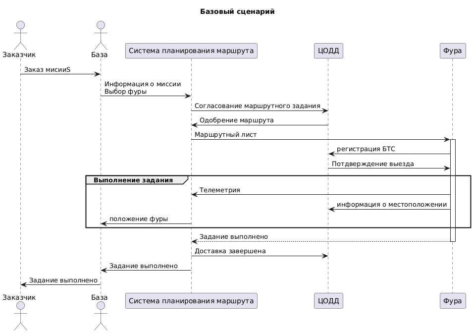

# Отчет о выполнеии задачи "Беспилотный тягач"

- [Отчет о выполнении задачи "Беспилотный тягач"](#отчет-о-выполнеии-задачи-беспилотный-тягач)
  - [Постановка задачи](#постановка-задачи)
  - [Ценности, ущербы и неприемлимые события](#ценности-ущербы-и-неприемлимые-события)
  - [Цели и предложения безопасности](#цели-и-предложеняи-безопасности-цпб)
  - [Архитектура системы](#архитектура-системы)
  - [Компоненты](#компоненты)
  - [Алгоритм работы решения](#алгоритм-работы-решения)
  - [Негативные сценарии](#негативные-сценарии)

## Постановка задачи

Компания создает беспилотный тягач для транспортировки грузов на большие расстояния, включая сложные участки дороги: такие как горные перевалы, лесные массивы и пустынные территории. Основной задаче является обеспечение автономного выполнения маршрута без постоянного вмешательства оператора.При этом важно учитывать, что на этих же дорогах могут находиться другие транспортные средства, включая спецтранспорт. Чтобы избежать потенциальных аварий, тягач должен быть способен предупреждать потенциальные аварии, корректно взаимодействовать с другими транспортными средствами и инфраструктурой

## Ценности, ущербы и неприемлимые события

| Ценность | Негативное событие | Оценка ущерба | Коментарий |
|:--|:--|:--|:--|
|Тягач| В результате атаки или сбоя системы тягач вышел из строя или был угнан | Средний | *Тягач застрахован, но простой в работе и необходимости восстановления могут привести к задержкам в доставке грузов.* |
|Люди| Тягач стал причиной ДТП, повлекшего вред здоровью или жизни людей | Высокий |*Наибольший приоритет - безопасеость людей. Необходимо минимизировать риски столкновений с другими транспортными средствами или пешеходами.* |
|Груз| Груз поврежден или утерян в рузельтате аварии или сбоя системы | Средний/Высокий | *Ущерб зависит от ценности груза. Потеря или повреждение критического груза (наример медицинского оборудования) может иметь серьезные последствия.* |
|Данные мониторинга| Данные о маршрутах, грузах и состоянии тягача оказались доступны злоумышленникам | Высокий | *Нарушение конфиденциальности, возможны утечки комерческой тайны или данных, защищенных законом.* |
|Инфраструктура| Тягач врезался в объект критической инфраструктуры | Высокий | *Повреждение инфрастуктуры может привести к масштабным последствиям, включая остановку работы объектов и значительные финансовые потери.* |
|Имущество третьих лиц| Тягач врезался в транспортное средство или объект частной собственности | Высокий | *Ущерб имуществу третих лиц может привести к судебным искам и репутационным потерям.* |
|Репутация компании| Авария или утечка данных привлекли внимание СМИ или регуляторов | Высокий | *Потеря доверия клиентов, штрафы со стороны регуляторов, возможны ограничения на использование автопилотируемых систем.* |
|Экология| Тягач стал причиной развала топлива или повреждения экологически чуствительных зон | Высокий | *Экологические последствия могут привести к штрафам и репутационному ущербу.* |

## Цели и предложеняи безопасности (ЦПБ)

### Цели безопасности: 

1. Выполняются только авторизированные ЦОДД задания
2. Все маневры и перемещения должны выполняться строго в соответствие с заданным маршрутом, ограничениями скорости и зонами движения.
3. В случае критического оттказа систем, тягач должен перейти в безопасный режим ( остановиться или снизить скорость до минимальной чтобы избежать аварий)
4. Погрузка/отгрузка груза осуществяются только в заднных координатах.

### Предложения безопасности:

1. Аутентичная система ЦОДД благонадёжна
2. Система управления маршрутом благонадёжна
3. Аутеннтичные сотрудники благонадёжны и обладают необходимой квалификацией.
4. Только авторизированные сотрудники управляют системами
5. Используемые сенсоры и исполнительные устройства работают в рамках заявленных характеристик.
6. Монитор безопасности и брокер сообщений доверенные модули.
7. Процедуры обновления и технического обслуживания проходят только в доверенной среде
8. Груз соответствует установленным требованиям безопасности.

## Архитектура системы

- Только инженер службы эксплуатации имеет физический доступ к транспортному средсвту.

### Взаимодействие системы

### Сценарий работы

## Компоненты

### Базовая архитектура

### Базовая диаграмма последовательности

|Компонент | Назначение |
|:--|:--|
|`1. Связь` | *Отвечает за взаимодействие с системой планирования маршрутом и ЦОДД.* |
|`2. Сбор и обработка данных` | *Собирает и анализирует данные об объектах вокруг транспортного средства для обеспечения безопасности.* |
|`3. Принятие решений` | *Использует данные, полученные в результате анализа, для принятия решений, которые влияют на работу системы и безопасность движения.* |
|`4. Центральная система управления` | *Осуществляет общее управление транспортом, контролирует выполнение задания.* |
|`5. Система мониторинга груза` | *Отслеживает состояние груза в пути и наличие в кузове.* |
|`6. Навигация` | *Предоставляет информацию о местоположении и направлении движения, используя данные GPS или другие навигационные системы.* |
|`8. Управление движением` | *Контролирует и координируют движение транспортного средства.* |
|`9. Исполнительные устройства` | *Отвечает за физическое выполнение команд, поступающих от системы управления движением, включая управление двигателем, рулевым управлением, тормозами и фарами.* |
|`10. Самодиагностика` | *Проверяет и анализирует состояние системы, выявляя возможные неисправности или проблемы.* | 

## Алгоритм работы решения

### Нарушение ЦБ(Целей безопасности) в базовом решении

***Напоминание ЦБ:***
1. *Выполняются только авторизированные ЦОДД задания.*
2. *Все маневры и перемещения должны выполняться строго в соответствие с заданным маршрутом, ограничениями скорости и зонами движения.*
3. *В случае критического оттказа систем, тягач должен перейти в безопасный режим ( остановиться или снизить скорость до минимальной чтобы избежать аварий)*
4. *Погрузка/отгрузка груза осуществяются только в заднных координатах.*

|Атакованный компонент| ЦБ1 | ЦБ2 | ЦБ3 | ЦБ4 | Кол-во нарушений|
|:--|:--|:--|:--|:--|:--|
|`1. Связь` | 🔴 | 🔴 | 🟢 | 🔴 | 3/4 |
|`2. Сбор и обработка данных` | 🟢 | 🔴 | 🟢 | 🟢 | 1/4 |
|`3. Принятие решений` | 🟢 | 🔴 | 🔴 | 🟢 | 2/4 |
|`4. Центральная система управления` | 🔴 | 🔴 | 🔴 | 🔴 | 4/4|
|`5. Система мониторинга груза` | 🔴 | 🔴 | 🔴 | 🔴  | 4/4
|`6. Навигация` | 🔴 | 🔴  | 🟢 | 🔴  | 3/4
|`8. Управление движением` | 🔴 | 🔴 | 🔴 | 🟢 | 3/4
|`9. Исполнительные устройства` | 🟢 | 🔴 | 🔴 | 🟢 |  2/4
|`10. Самодиагностика` | 🟢 | 🟢 | 🔴 | 🟢 | 1/4
🟢 - ЦБ - не нарушена 🔴 - ЦБ нарушена

## Негативные сценарии

### Цели безопасности:

1. Выполняются только авторизированные ЦОДД задания
2. Все маневры и перемещения должны выполняться строго в соответствие с заданным маршрутом, ограничениями скорости и зонами движения.
3. В случае критического оттказа систем, тягач должен перейти в безопасный режим ( остановиться или снизить скорость до минимальной чтобы избежать аварий)
4. Погрузка/отгрузка груза осуществяются только в заднных координатах.

### Таблица негативных сценариев

| Негативные сценарии |   |
|:--:|:--:|
|**НС-1**| *Модуль связи передаёт некорректные координаты загрузки/отгрузки в центральную систему управления, что приводит к нарушению ЦБ 1,2,4* |
|**НС-2**| *Модуль навигации отдаёт неправильные данные о местоположении тягача, что приводит к отклонению от заданного маршрута и нарушению ЦБ 1,2,4* |
|**НС-3**| *Модуль самодиагностики не обнаруживает критический отказ двигателя или тормозной системы, что приводит к невозможности перехода в безопасный режим и нарушению ЦБ 3* |
|**НС-4**| *Модуль управления движением отправляет некорректные сигналы на исполнительные устройства, что приводит к несанкционированному ускорению или торможению, нарушая ЦБ 2.* |
|**НС-5**| *Модуль связи скомпрометирован. При получении запрета на выезд от ЦОДД, система распознаёт его как разрешение и начинает движение по запрещённому маршруту, нарушая ЦБ 1 и ЦБ 2* |
|**НС-6**| *Модуль принятия решений скомпрометирована. Атака приводит к тому, что модуль принятия решений начинает игнорировать ограничения скорости или запрещённые зоны движения, корректируя управляющие команды в нарушение требований. Нарушается ЦБ 2* |
|**НС-7**| *Модуль исполнительных устройств скомпроментирован. Подмена верных команд он выполняет не верные управляющие команды. ЦБ 2,3,4* |

## Негативные сценарии 

### НС-1

### НС-2

### НС-3

### НС-4

### НС-5

### НС-6

### НС-7

